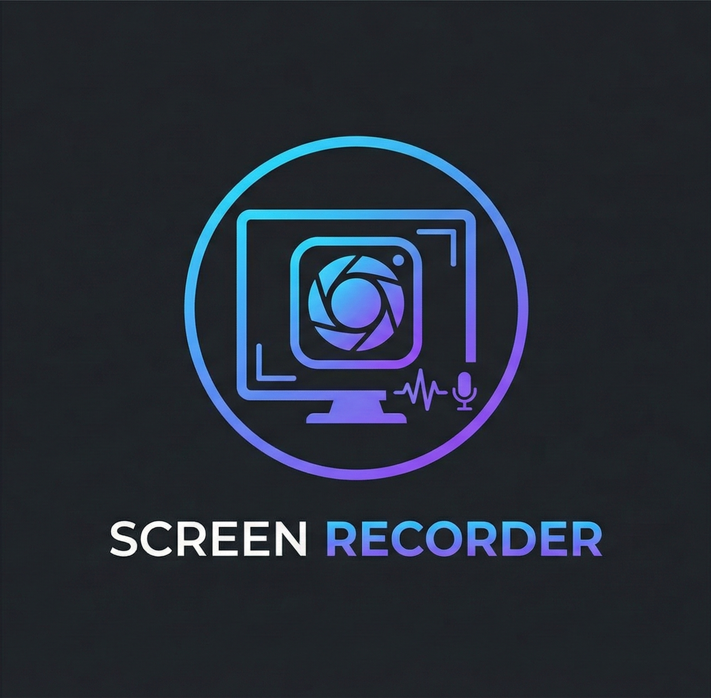

# 🎥 PyScreen Recorder

A high-performance, modern screen recording application built with Python and Qt. Designed for Windows with a sleek "Fluent-like" dark theme, it supports high-fps capture, system audio recording, and versatile capture modes.



## ✨ Features

### 🖥️ Versatile Recording Modes
*   **Full Screen**: Capture your entire desktop in high definition.
*   **Window Mode**: Automatically detects and lists open windows for dedicated recording.
*   **Custom Region**: Interactive overlay to draw and select a specific area to record.

### 🎧 Advanced Audio
*   **System Audio**: Captures desktop sounds (loopback) with high clarity.
*   **Microphone**: Records voice commentary simultaneously.
*   **Visual Feedback**: Real-time status indicators (●) show active audio devices.

### 🎨 Modern UI/UX
*   **Dark Theme**: Professional dark interface (`#202020`) with card-based layout.
*   **Fluent Design**: Rounded corners, accent colors, and Segoe UI variable typography.
*   **Countdown**: Customizable countdown timer before recording starts.
*   **Status Bar**: Context-aware status updates and timer display.

### ⚙️ Performance & Quality
*   **High Performance**: Multithreaded capture pipeline using `mss` with thread-local storage optimization.
*   **Smooth Playback**: Implements Constant Frame Rate (CFR) logic to ensure perfect audio/video sync.
*   **Configurable**:
    *   **Resolution**: 720p, 1080p, 1440p, 4K support.
    *   **FPS**: 24, 30, or 60 FPS options.
    *   **Quality**: Preset bitrates (Low/Medium/High) or custom values.

---

## 🛠️ Installation

### Prerequisites
1.  **Python 3.10+**: [Download Python](https://www.python.org/downloads/)
2.  **FFmpeg**: Required for video encoding.
    *   Download from [gyan.dev](https://www.gyan.dev/ffmpeg/builds/) or use `winget install ffmpeg`.
    *   **Important**: Ensure `ffmpeg.exe` is in your system `PATH` or placed in the project root.

### Setup
1.  Clone the repository:
    ```bash
    git clone https://github.com/yourusername/screen-recorder.git
    cd screen-recorder
    ```
2.  Install dependencies:
    ```bash
    pip install -r requirements.txt
    ```

---

## 🚀 Usage

Run the application:
```bash
python main.py
```

### Quick Start Guide
1.  **Select Mode**: Choose between Full Screen, Window, or Region.
2.  **Check Audio**: Verify System Audio and Microphone indicators are active if needed.
3.  **Start**: Click **Start Recording** (or use the configured hotkey).
4.  **Stop**: Click **Stop** to finish. The video is automatically merged and saved.
5.  **Locate File**: The output path is displayed at the bottom of the window (default: `Records/`).

---

## 🔧 Configuration

Click the **Configure...** button to access advanced settings:

*   **Video**: Resolution, FPS, and Bitrate presets.
*   **Audio**: Toggle audio sources.
*   **Countdown**: Enable/Disable and set duration (1-10s).

---

## 💻 Tech Stack

*   **GUI**: [PyQt6](https://pypi.org/project/PyQt6/)
*   **Capture**: [mss](https://pypi.org/project/mss/) (Fast cross-platform screen shot)
*   **Audio**: [sounddevice](https://pypi.org/project/sounddevice/) (PortAudio wrapper)
*   **Processing**: [FFmpeg](https://ffmpeg.org/) (Video muxing and encoding)
*   **Process Management**: `subprocess` & `threading`

---

## 📝 Troubleshooting

**"No loopback device found"**
*   Ensure "Stereo Mix" is enabled in Windows Sound settings if using older drivers, or ensure usage of WASAPI loopback (default in app).
*   If basic loopback fails, the app attempts to fallback to microphone only.

**Video plays too fast**
*   This version implements CFR (Constant Frame Rate). If this persists, ensure your PC can handle the selected FPS/Resolution. Try lowering specific settings.

**FFmpeg not found**
*   Verify `ffmpeg -version` works in your terminal.
*   Or place `ffmpeg.exe` directly next to `main.py`.

---
